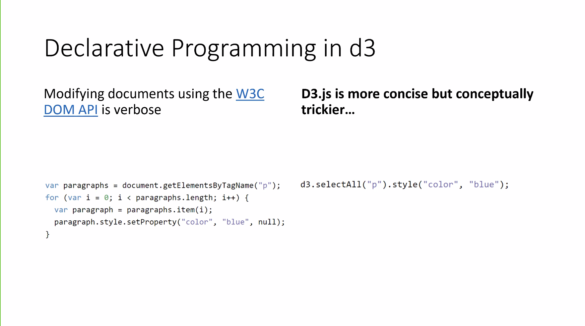
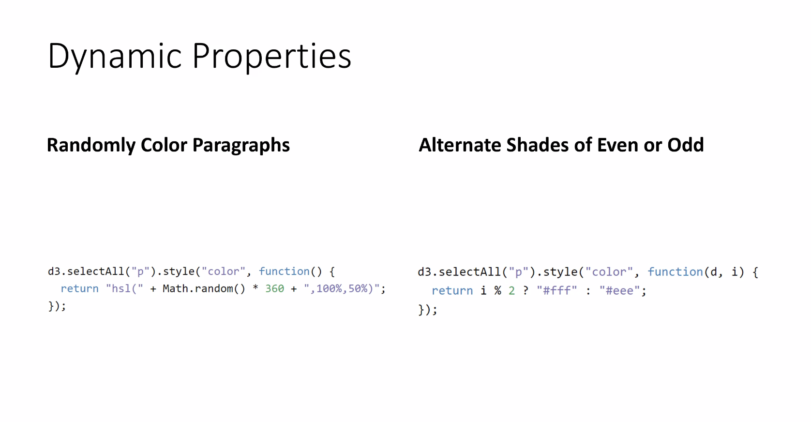
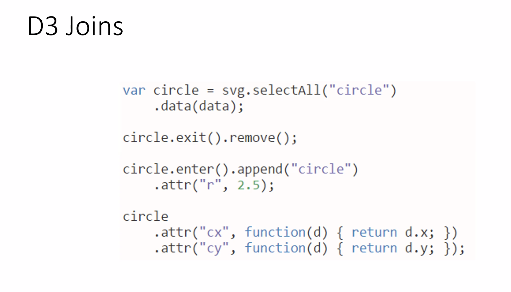
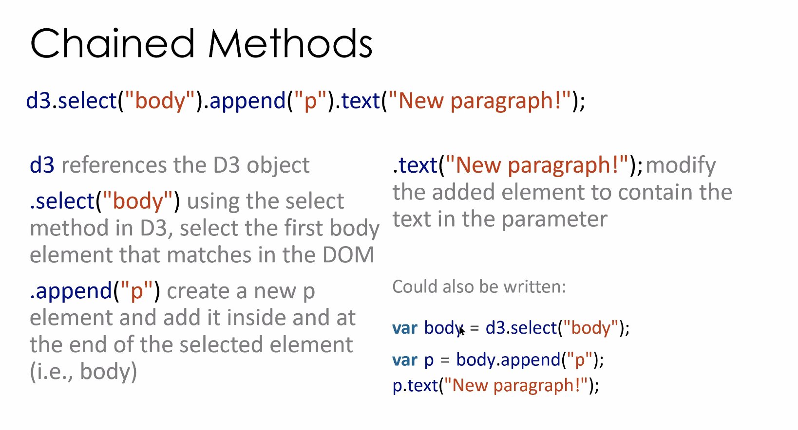
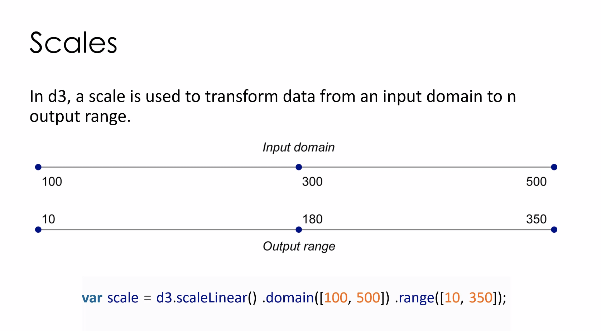

d3 is more concise but conceptually trickier:

-----------------
change text color of p tags, randomly or every other:

- d = data item
- i is iterator as usual
- second (right) function is a callback function
-----------------

---

---

- d3.scaleLinear() = most common 
xScale = d3.scaleLinear().domain([xlow,xhigh]).range([0,svgWidth])
yScale = d3.scaleLinear().domain([ylow,yhigh]).range([0,svHeight])

---
.data(dataset)
Counts and parses our data values. There are five values in our array called dataset, so everything past this point is executed five times, once for each value.

.enter()
To create new, data-bound elements, you must use enter(). This method looks at the current DOM selection, and then at the data being handed to it. If there are more data values than corresponding DOM elements, then enter() creates a new placeholder element on which you can work your magic. It then hands off a reference to this new placeholder to the next step in the chain.
