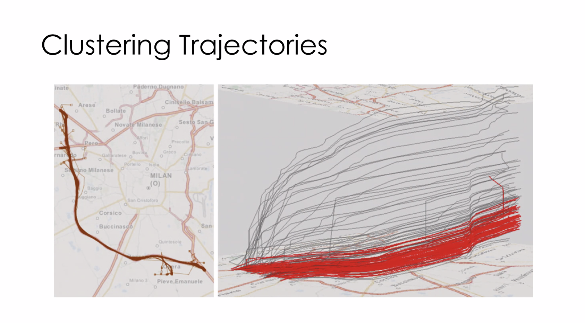
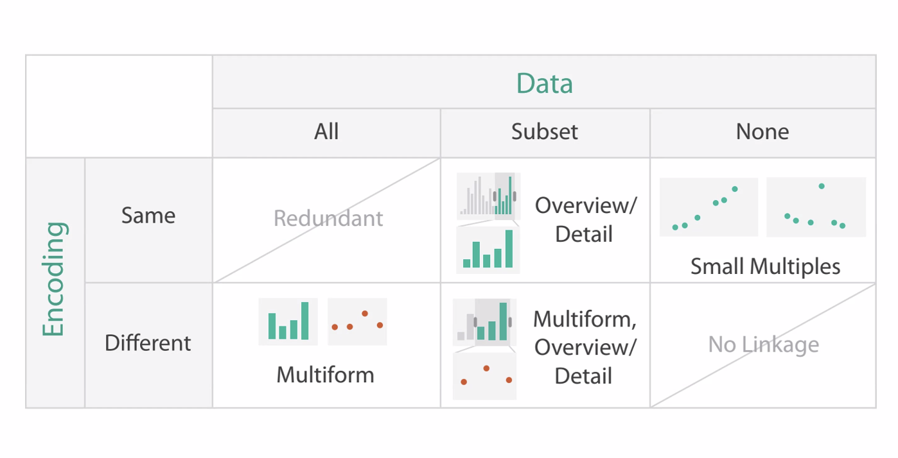
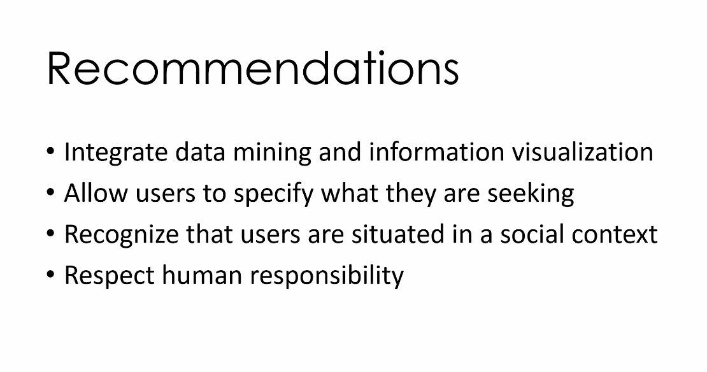
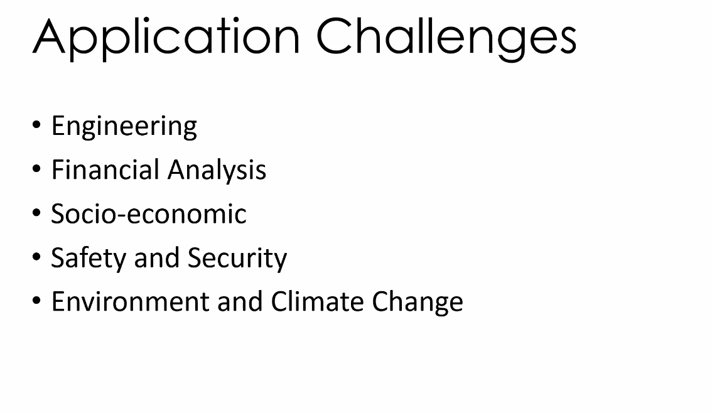

**Common Reasons DV can fail**

**What Why How**

What? do we consider

Why? Do we consider it

How? Do we realize it?

# Intro to D3.JS (part 1)
**Cli side code** = mostly javascript
- code that is running in a browser
- kind of like its own mini op system
- all code runs in browser never on your actual system

**Browser
Server Side
Web Server**
- connected to one or more databases
**Database
OS**

### LAMP ---> describes Backend
- linux
    - server OS, runs application
- Apache
    - server applic
    - handles http reqs
- MySQL
    - DMMS (database management system)
    - stores large amounts of data
    - why: there's not enough space on your own RAM to always store these things
- PHP / Node.js
    - server-side scripting lang
    - provides synamic web content and queries DBMS

####HEPJ ---> the modern day lamp
Heroku/AWS/Docker Container
- instead of running something in Linux, host on a cloud host (still running linux but u dont need physical server)

Express.js(node.js)/Flask (python)
PostgreSQL/MongoDb

JavaScript/Python 
- instead of PHP
- js if node , python if flask

##### Node.js
- server-side javascript
- if u seen "require", code is meant for node.js

##### Heroku
- Cloud-based server for web-based apps
- easy to deploy with git-based command

#### Data Sources
- Flat files
    - CSVs
        - good for when a list of rows can be desribed using exactly same columns - not good for objects w dif attributes
    - JSON
        - more flexible than CSV
    - GeoJSON
        - just JSON with some constraints
        - features ave geometry
        - properties 
    - XML
        - similar to JSON w indented hiarch structure w/objs and attributes
        - formatted differently 
        - Looks like HTML
- Relat DBs
    - stores a lot of data that would not otherwise fit into RAM
    - rel means they are like spreadsheets linked tg through common keys
    - schema of table is rigid (format)
    - 
- SQLite
    - in middle 
    - SQL but w out a server
    - Godwin recommended ... easier than buildng a web server
- NoSLQ (eg. MongoDB)
    - 
- APIs 
    - web APIs
    - call a page through an HTTP request
    - message returns as XML or JSON
    - the format of requests affects type & extent of data returned
    - designed as a middleman to let outsiders have access to portions of info
    
 
 #### HTML
 - HTML files are just text files
    - have HTML files as a suffix using a web server
 - not executable code 
 - opening 
 - you can create a file, save it, & just double click it, but you should never do that
    - security features will keep some things from working
    - won't work if it needs to connect to other files in your dir bc it isn't on a server
 - Opening HTML pages
     - start a python web server via terminal
        - python
            - python -m SimpleHTTPServer 8888
        - python 3
            - python -m http.server 8888
      - type in localhost8888 into browser
        - local host is your machine, code is served on port 8888
        - the thing doing the server is python
     - OR if you're using webstorm, just click the run button
     
- Tags
    - h1 - big title, then h2,h3,h4
    - lists
        z unordered list (bulleted)
            <ul> 
                <li> item</li>
                <li> item</li>
               </ul>
         - ordered list (numbered)
        <ol>
        <li>item</li>
        <li> item</li>
        <item> item </item>
        </ol>
        
     <a> "a" tag tells us something is a link </a>
     
     
 ** in webstorm if you type < you can see a list of tags **
 
 ### DOM (document Object Model)
 - refers to hierarch structure of HTML
 - each tag is an element
 - refer to relationship btwn elements
    - parents
    - child
    - sibling
    - ancestor
    - descendant
    
# If a file is really big, you don't want to start drawing shapes or accessing data b4 it has loaded    

### action target pairs

# Marks and Channels 
### dif types of channels

- can be width too

### selecting channels based on data types

- be careful not to use wrong types os channels

### grouping

### tabular data vis

### how to do what how why

 
#### another what how why 

# MAPS

#### Types of maps:

- fields = heat map

#### different binning yield different results

#### Tobler's First Law

#### 

#### Tree maps

####Radial Layouts

## 2/26/21

#### scalar field 

a lot like an isoline

#### space time problem

#### Clustering trajectory

- type of bundling
- helpful w/time & movement thru space

####map tools

#### map tools

- unfolding = similar to proc - has support for touch & pen support
- geotools = for java
- ArcPy & geopandas = for python
- color brewer = good for chlor map coloring

# NETWORKS

- directed network: cycles
### Node-link diagrams
node/tree terminology

- tree root at root

### network centrality

- betweenness centrality = trickier. Need to determine shortest paths like closeness, then you need to examine it. Means whatever path you have to take through a network will often fall on shortest path
- - example: call - whatever the shortest path is btwn you and caller, that's the path your network will connect you to

### types of network visualizations

- #### node link networks
        
    - force-directed trees/placement
           
         
        
    - arc diagrams
      
        - shows connections
    

- ### adjacency matricies

- rectolinear layout
    - ordering nodes accross top & sides
    
- node-link represented as adjacency matrix 

- #### Hive plot

# 3/23/21
# Network Analysis
### 8 ways to represent tree based data

- A = most intuitive
- B = same as A but rotated to left
- C = icicle diagram
    - root gets full width, elements below are children, their width indicates how many children they have
- D = radial node length
    - lets you follow paths easily bc of lines
- E = instead of lines, uses adjacency
    - not that dif from C
    - C is to A as D is to E
    - subdividing area to show parent child relationships
- F = uses containment
    - set and subset rela
    - root is outer circle
    - how far u have to go 
- G = tree map
    - rectolinear arrangement & using containment
- H = indented view
    - ex. python, browser inspection
- they're all uniform (each parent has same amt of children)

## Tree maps

- works well for millions of lead nodes & mils of links

#### tmaps kinds of layoutst

#### paralell sets
- use categorical dimensions to subdivide
- subdivide by male & female then again based on whether you survive

data for trees doesn't have to use tree-like data, you can form data into a tree
####sunbursts

#### voronoi & quadtree = also a treemap

### PivotGraphs

- given a large graph / network, we might care most about intersection of categories & how they relate to eacother
- basically a node-link network but rolled up
- rolling up a graph and looking at connections
one key:

- most interested in how many links btwn one category to the next

multiple keys:

- looking at intersections and connections based on category identities on the left

# 3/26/21
# color thoery

linguistic relativity: 

## rods and cones
- cones: light vs dark
- rods: perception of color
- #### trichromatic theory = in terms of RGB
- #### Opponent process theory 
    - 3 types of cones" large, medium and small that perceive brightness, hue & colorfulness
    - looks at our brain as a neural network
    - better for datavis
    - after images
        - look at something blue, yellow processors are tired out
        - flip to a blank screen & those cells are still hyper active
 
 animal that sees the most colors: mantis shrimp
 
 ## different color spaces
  
 
 
 ### HSL/HSB
 - lumincance (adding white)
 - hue 
 - saturation (adding black)
 - HSL and "LAB" give us more control over color & how much it pops
 
 
 
 
 ### rgb
  
 - problem: to move from white to blue, you can't just add white. you also need to change other color values
 
 rainbows:
   
   
  ## choosing colors based on data (binary, sequential,diverging)
  
  '
  
# Other channels
  '

## angle channel
  ' 
  
## arrows & lines in node-link diagram
- lines in node-link diagrams communicate different things & some are more effective than others
- '
- '
- ex. A (arrow) just tells the direction, nothing else

# 3/30/21
## Animated Transitions

- eyes beat memory
    - animated transitions: instead of clearing and showing new, do animated transition
  
Selections:  
 
- details on demand: how do you want to show selection? hover, highlight, etc
- ways to show selections
    -  
        - ex of d3 hover / brushing (dynamic query)
            - 
            
Geometric v Semantic zoom
- geo = camera zoom
- semantic = idiom, elements shown change (more details on demand)
    - ex. google maps when map gets more detailed as you zoom

Sparklines            
- 
## Attribute reduction

- important for soft eng & data science
- Slice, cut, project
    - 
        - slice: take a thin range of attributes & keep everything above range or below
        - cut: keep everything below a range & discard rest
        - project: reduce attrs
            - ex. choose from a tabular dataset & pick a few 
            - projection tries to incorperate discarded info in some way
            - width, height, & depth:
                - stair example:
                    - 

## PCA (principle component analysis)

# 4/2/21
## Faceting
- creating different views with the same data
    - superimpose, juxtapose, partition
    
- Methods 
    - 
        - share encoding: same/dif
        - share data
        - share navigation (toggling, panning, & zooming)
- design choices: data and encoding  
    - 

## Partition into views:
- dif ways to seperate
    - trellis display
    
    - looks at change from 1 to year 2 for each year
    - maps
        - first split by types (flat, semi)
        - second split by neighborhoods
        - the way you partition a map will show different results
         
 - Superimposing Layers
    - basically just layer control
    
Line graph, small multiples, & Horizontal Graph        
 
 
 
 
# 4/6/21
## Reduction
- why reduce? 
     
    - reduce amount of visual complexity because humans can only take in so much info at once
    - ### caution: out of site = out of mind
        - if something is filtered out, users may draw incomplete or incorrect conclusions so be careful when reducing
    
## filter & dynamic v static query
- dynamic v static query
    - static query
        - send query 2 Db and wait for result to come back
    - dynamic = live updates
        - why dynamic is rare: if query result takes a sec 2 come back (would have2 query db) it's not really dynamic
        - prefetching (pre-fetching ) 
            - makes it possible if using a DB - can pre fetch results on a range of a slider
    - tight coupling between input and output - details on demand
    - scented widgets
         
        - improves queues with embedded visualizations
        - allows you to guide users on what they query
        - can help save users from wasting time
    - DOFSA
        - filtering out redundant info & ordering them by how similar/ dif they are
## Aggregate
-      
- histogram = one of most common tools for automatic aggregation
- continuous scatterplot 
    -   
        - pic on right = cont scat
        - counting # times we draw to a given pixel 2 buffer
        - then get min, max, scale & display
        - translates from discrete to continuous
- box plot
    -     
    - alternative to histogram
        - 50% of data inside box, 25% in upper, 25% in lower extreme
    - alternative designs for box-plots
        -  
        - vase plot, violin plot, bean plot
            -  
- bullet graph (n)
-            
-    

Geographically weighted visualizations (n)
  
   

# 4/13/21

# Embedding
degree of interest and focal points

- zoom, adjust, and slide

    - 
    
## 4 Approaches to graph exploration 
- fisheye lens, magnifying lens, neighborood layering, bring and go

    - 
    
        - neighborhood layering ---> showing things connected to a node 
            - ex. show me eithering connected by 3 hops
            
        - bring and go
            - path following
            - snaps available nodes that are connected to current link (bring) & then click which one to go to

# Text visualization

- word cloud = bad

- ContexTour & FacetAtlas
    - 
    
## document similarity

- 

    - take a dataset where docs are similar enough to create something
    - #### Term frequency - Inverse Document Frequency
        - bag of words
        - 
            - term frequency: amt of times words occur
            - IDF: filtering out words that don't matter
        
                - A word like "the" occuring a lot in 2 different documents doesn't make them similar
### document summary
- "is a" relationships
    -- 
    
    
# 4/16/21

# Text

wattenburg & vieg = probably who pioneered whatever datavis thing

### PhraseNet
   - trying to understand phrases in a text & how those tell us how th auther uses language
   
    
### Web Seer
   - bias in search engines
   - http://hint.fm/seer/#left=why%20do%20professors&right=why%20do%20teachers
    

### story boards
 - ex: lifelines
 
 - #### theme rivers 
    - 
 
- #### outflow
    - height vertical is patients who have experienced, then we can find who has had positive vs negative outcome
     - 
- ### sentiment analysis tells you if pos or neg

--------------------------------------

# Visual analytics
## what is visual analytics?
- science is what sets it apart, Keim has a more thourough definition

## main components of info vis
- 

- dif from data vis, for DV there is an establisheed task 
- Visual analytics is broader, not just coming up with a new bar chart
    - incorperate dif techniques & incorperate ML 
    - bridge the gap
    - ### recommendations to fix dv problem
    
- ### the invoVis pipeline
     
    - things we have 2 do to a dataset to get it in the form we want, 
    - all of these elements ignore something important...
        - user is just one little box
 - ### The visual analytics process
    - ### keims alternative vs Shneiderman
        - for a long time at conferences there was a split btwn the 2, but as of this year it's just vis conference
    - ### the visual analytics pipeline 
             
        - now user is more than just a box  
        - the more you know about a dataset, the more hypotheses you can make = change of how you want to visualize the data = process begins all over again
        
 - ### infovis pipeline vs visual analytics pipeline
   
- ### Application challenges
    -  
    - practical examples
- Integrating data mining and  ML
    - dimension reduction
    - 
        - PCA (principal component analysis), MDS ....
            - 
            - what does a user see as a result of PCA
                - ### coupling mental models & data models
                    - 
                    - distance
                    - congition: we see things that are close together as being related
                    - to system
                    - * we want to adjust a vis so user sees what they're supposed to
                    
        - ## img
    - feature selection
        - entity extraction
    - similarity functions
        - "find more like this..."
    - prediction
        - will a stock price go up or down?

interaxis: https://va.gatech.edu/live-projects/interaxis/
- click & drag x & y axis

