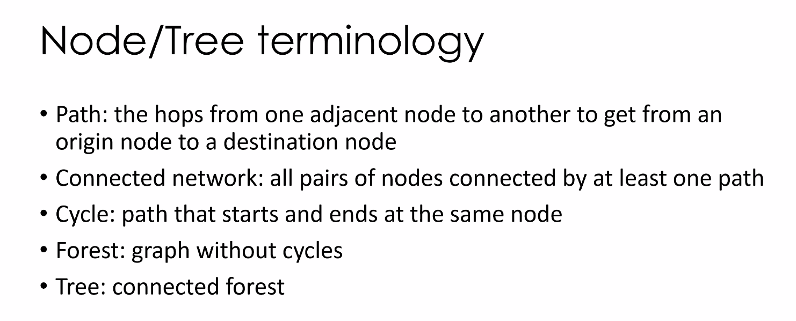
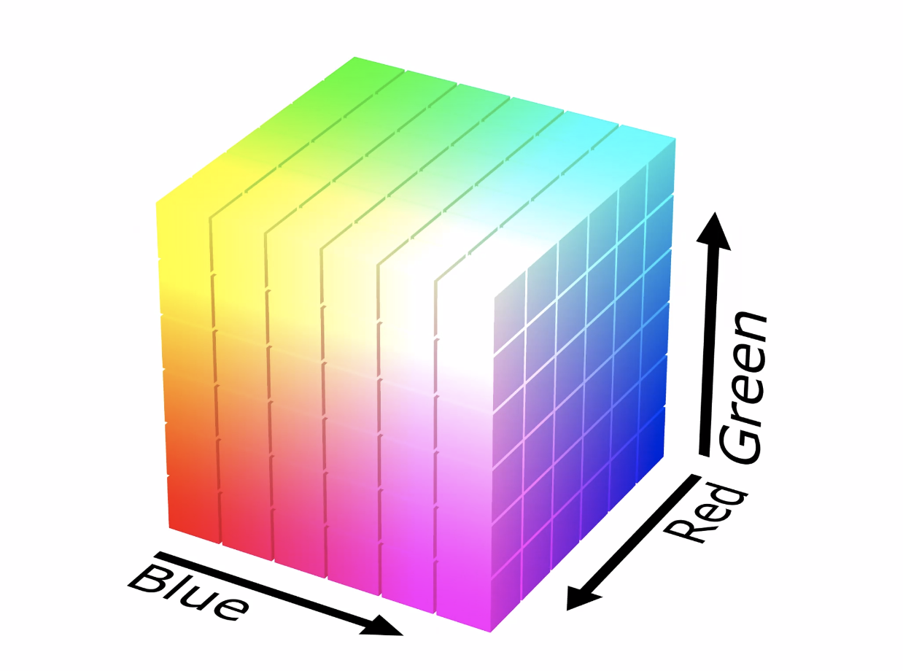
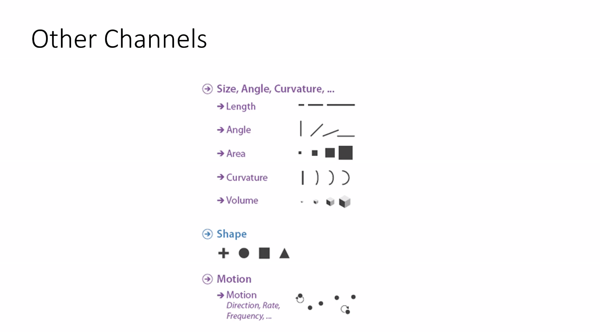

**Common Reasons DV can fail**

**What Why How**

What? do we consider

Why? Do we consider it

How? Do we realize it?

# Intro to D3.JS (part 1)
**Cli side code** = mostly javascript
- code that is running in a browser
- kind of like its own mini op system
- all code runs in browser never on your actual system

**Browser
Server Side
Web Server**
- connected to one or more databases
**Database
OS**

### LAMP ---> describes Backend
- linux
    - server OS, runs application
- Apache
    - server applic
    - handles http reqs
- MySQL
    - DMMS (database management system)
    - stores large amounts of data
    - why: there's not enough space on your own RAM to always store these things
- PHP / Node.js
    - server-side scripting lang
    - provides synamic web content and queries DBMS

####HEPJ ---> the modern day lamp
Heroku/AWS/Docker Container
- instead of running something in Linux, host on a cloud host (still running linux but u dont need physical server)

Express.js(node.js)/Flask (python)
PostgreSQL/MongoDb

JavaScript/Python 
- instead of PHP
- js if node , python if flask

##### Node.js
- server-side javascript
- if u seen "require", code is meant for node.js

##### Heroku
- Cloud-based server for web-based apps
- easy to deploy with git-based command

#### Data Sources
- Flat files
    - CSVs
        - good for when a list of rows can be desribed using exactly same columns - not good for objects w dif attributes
    - JSON
        - more flexible than CSV
    - GeoJSON
        - just JSON with some constraints
        - features ave geometry
        - properties 
    - XML
        - similar to JSON w indented hiarch structure w/objs and attributes
        - formatted differently 
        - Looks like HTML
- Relat DBs
    - stores a lot of data that would not otherwise fit into RAM
    - rel means they are like spreadsheets linked tg through common keys
    - schema of table is rigid (format)
    - 
- SQLite
    - in middle 
    - SQL but w out a server
    - Godwin recommended ... easier than buildng a web server
- NoSLQ (eg. MongoDB)
    - 
- APIs 
    - web APIs
    - call a page through an HTTP request
    - message returns as XML or JSON
    - the format of requests affects type & extent of data returned
    - designed as a middleman to let outsiders have access to portions of info
    
 
 #### HTML
 - HTML files are just text files
    - have HTML files as a suffix using a web server
 - not executable code 
 - opening 
 - you can create a file, save it, & just double click it, but you should never do that
    - security features will keep some things from working
    - won't work if it needs to connect to other files in your dir bc it isn't on a server
 - Opening HTML pages
     - start a python web server via terminal
        - python
            - python -m SimpleHTTPServer 8888
        - python 3
            - python -m http.server 8888
      - type in localhost8888 into browser
        - local host is your machine, code is served on port 8888
        - the thing doing the server is python
     - OR if you're using webstorm, just click the run button
     
- Tags
    - h1 - big title, then h2,h3,h4
    - lists
        z unordered list (bulleted)
            <ul> 
                <li> item</li>
                <li> item</li>
               </ul>
         - ordered list (numbered)
        <ol>
        <li>item</li>
        <li> item</li>
        <item> item </item>
        </ol>
        
     <a> "a" tag tells us something is a link </a>
     
     
 ** in webstorm if you type < you can see a list of tags **
 
 ### DOM (document Object Model)
 - refers to hierarch structure of HTML
 - each tag is an element
 - refer to relationship btwn elements
    - parents
    - child
    - sibling
    - ancestor
    - descendant
    
# If a file is really big, you don't want to start drawing shapes or accessing data b4 it has loaded    

### action target pairs

# Marks and Channels 
### dif types of channels

- can be width too

### selecting channels based on data types

- be careful not to use wrong types os channels

### grouping

### tabular data vis

### how to do what how why

 
#### another what how why 

# MAPS

#### Types of maps:

- fields = heat map

#### different binning yield different results

#### Tobler's First Law

#### 

#### Tree maps

####Radial Layouts

## 2/26/21

#### scalar field 

a lot like an isoline

#### space time problem

#### Clustering trajectory

- type of bundling
- helpful w/time & movement thru space

####map tools

#### map tools

- unfolding = similar to proc - has support for touch & pen support
- geotools = for java
- ArcPy & geopandas = for python
- color brewer = good for chlor map coloring

# NETWORKS

- directed network: cycles
### Node-link diagrams
node/tree terminology

- tree root at root

### network centrality

- betweenness centrality = trickier. Need to determine shortest paths like closeness, then you need to examine it. Means whatever path you have to take through a network will often fall on shortest path
- - example: call - whatever the shortest path is btwn you and caller, that's the path your network will connect you to

### types of network visualizations

- #### node link networks
        
    - force-directed trees/placement
           
         
        
    - arc diagrams
      
        - shows connections
    

- ### adjacency matricies

- rectolinear layout
    - ordering nodes accross top & sides
    
- node-link represented as adjacency matrix 

- #### Hive plot

# 3/23/21
# Network Analysis
### 8 ways to represent tree based data

- A = most intuitive
- B = same as A but rotated to left
- C = icicle diagram
    - root gets full width, elements below are children, their width indicates how many children they have
- D = radial node length
    - lets you follow paths easily bc of lines
- E = instead of lines, uses adjacency
    - not that dif from C
    - C is to A as D is to E
    - subdividing area to show parent child relationships
- F = uses containment
    - set and subset rela
    - root is outer circle
    - how far u have to go 
- G = tree map
    - rectolinear arrangement & using containment
- H = indented view
    - ex. python, browser inspection
- they're all uniform (each parent has same amt of children)

## Tree maps

- works well for millions of lead nodes & mils of links

#### tmaps kinds of layoutst

#### paralell sets
- use categorical dimensions to subdivide
- subdivide by male & female then again based on whether you survive

data for trees doesn't have to use tree-like data, you can form data into a tree
####sunbursts

#### voronoi & quadtree = also a treemap

### PivotGraphs

- given a large graph / network, we might care most about intersection of categories & how they relate to eacother
- basically a node-link network but rolled up
- rolling up a graph and looking at connections
one key:

- most interested in how many links btwn one category to the next

multiple keys:

- looking at intersections and connections based on category identities on the left

# 3/26/21
# color thoery

linguistic relativity: 

## rods and cones
- cones: light vs dark
- rods: perception of color
- #### trichromatic theory = in terms of RGB
- #### Opponent process theory 
    - 3 types of cones" large, medium and small that perceive brightness, hue & colorfulness
    - looks at our brain as a neural network
    - better for datavis
    - after images
        - look at something blue, yellow processors are tired out
        - flip to a blank screen & those cells are still hyper active
 
 animal that sees the most colors: mantis shrimp
 
 ## different color spaces
  
 
 
 ### HSL/HSB
 - lumincance (adding white)
 - hue 
 - saturation (adding black)
 - HSL and "LAB" give us more control over color & how much it pops
 
 
 
 
 ### rgb
  
 - problem: to move from white to blue, you can't just add white. you also need to change other color values
 
 rainbows:
   
   
  ## choosing colors based on data (binary, sequential,diverging)
  
  '
  
# Other channels
  '

## angle channel
  ' 
  
## arrows & lines in node-link diagram
- lines in node-link diagrams communicate different things & some are more effective than others
- '
- '
- ex. A (arrow) just tells the direction, nothing else

